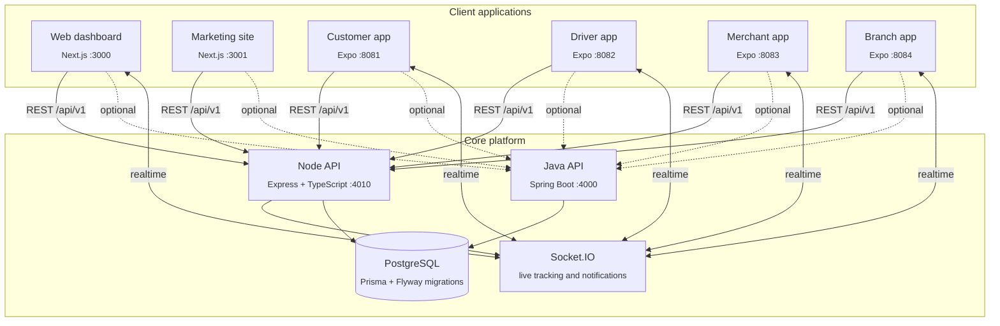
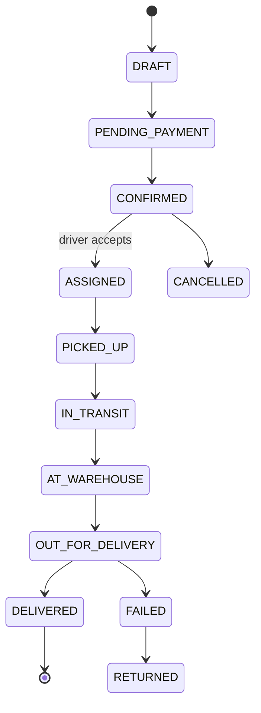
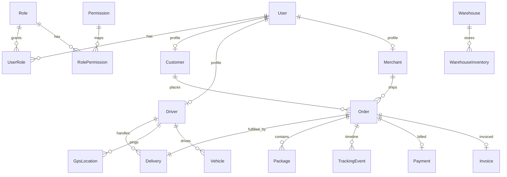

<div align="center">

# GUZO

### Enterprise logistics & delivery platform

**Book | Dispatch | Track | Deliver - across web, mobile, and API**

<br/>

[](LICENSE)
[](https://nodejs.org/)
[](https://www.typescriptlang.org/)
[](https://www.postgresql.org/)
[](https://expressjs.com/)
[](https://nextjs.org/)
[](https://expo.dev/)
[](https://socket.io/)

<br/>

**One API | One PostgreSQL database | Seven client applications | Realtime tracking**

> **Dual backend:** The default dev API is **Node/Express** (`apps/server`, port **4010**). A **Java/Spring Boot** mirror (`apps/guzo-api`, port **4000**) shares the same PostgreSQL schema for production-target deployments. Web and mobile clients work with either stack via `API_BASE` / `EXPO_PUBLIC_API_URL`.

<br/>

[Overview](#overview) | [Architecture](#architecture) | [Applications](#applications) | [Data layer](#data-layer) | [API](#api-server) | [Auth & RBAC](#authentication--rbac) | [Quick start](#quick-start) | [Demo logins](#demo-accounts) | [Documentation](doc/README.md) | [Changelog](doc/CHANGELOG.md)

<br/>

[](https://github.com/abel2800/Guzo)

</div>

---

<br/>

## Overview

**GUZO** is a full-stack logistics platform - the kind of system behind Uber Delivery, FedEx, or DHL - built as a **modular monolith** that runs on your machine today and scales to production tomorrow.

Every shipment, GPS ping, payment, notification, and support ticket is stored in **PostgreSQL** and served through a typed **REST API** plus **Socket.IO** realtime channel. Seven dedicated clients share the same backend:

| | |
|:---:|:---:|
| **7 applications** | Node API | Java API | Web dashboard | Marketing site | Customer | Driver | Merchant | Branch |
| **36 database tables** | Users, orders, deliveries, payments, tracking, warehouses, support... |
| **37 API modules** | Auth, OTP, orders, drivers, receivers, merchants, analytics, and more |
| **10 user roles** | Admin, customer, driver, merchant, warehouse, finance, support... |
| **90+ permissions** | Fine-grained `resource.action` access control |

### Why GUZO?

| Principle | What it means |
|-----------|---------------|
| **Local-first** | Runs entirely on one machine - no cloud required to develop |
| **Free & open-source stack** | PostgreSQL, Prisma, Express, Next.js, Expo, OpenStreetMap, Socket.IO |
| **Cloud-ready** | Provider abstractions (storage, payments, SMS, push) and clean module boundaries |
| **End-to-end typed** | Shared TypeScript contracts from database -> API -> web -> mobile |
| **Production patterns** | JWT + refresh tokens, RBAC, phone OTP, rate limiting, audit logs, file uploads, background jobs |

### Recent updates (July 2026)

| Area | Highlights |
|------|------------|
| **Auth** | Phone OTP on signup (web + 4 mobile apps); forgot password via email or phone OTP |
| **Pickup flow** | Barcode/QR/PIN for senders; driver scan pickup; slide-to-confirm trip actions; receiver notified on driver arrival |
| **Driver** | Vehicle profile (type, plate, photo); jobs pool includes `CONFIRMED` and `AT_BRANCH` orders |
| **Tracking** | Customer sees driver photo, vehicle, and plate on active deliveries |
| **Branch** | Receive package → receiver notified when ready for pickup |
| **UI** | Clickable stats, notifications, and list rows across web and all mobile apps |
| **Admin** | Approved drivers/merchants/branches can log in (`user.status` set to `ACTIVE`) |

Full details: **[doc/CHANGELOG.md](doc/CHANGELOG.md)** · API reference: **[doc/api-servers.md](doc/api-servers.md)**

---

## Architecture



**Request flow:** Client -> Helmet -> CORS -> body parsing -> rate limit -> JWT auth -> RBAC -> module handler -> Prisma -> PostgreSQL -> JSON response (+ Socket.IO broadcast when status changes).

---

## Applications

### 1. API servers

| Stack | Path | Default port | Start |
|-------|------|--------------|-------|
| **Node (primary dev)** | `apps/server` | **4010** | `npm run dev:server` |
| **Java (production target)** | `apps/guzo-api` | **4000** | `npm run dev:server:java` |

Both expose `GET /api/v1/health` and share one PostgreSQL database. Schema is owned by **Prisma** (`packages/database`) with manual SQL in `prisma/migrations-manual/`; Java applies the mirrored DDL via **Flyway** (`V100+`).

The Node server is the heart of day-to-day development — Express + TypeScript modular monolith (`routes → controller → service → repository`).

| Capability | Details |
|------------|---------|
| **37 feature modules** | See [API server](#api-server) section |
| **Auth** | JWT access (15m) + refresh (7d), token rotation, session tracking |
| **Security** | Helmet, CORS, rate limiting, Bcrypt passwords, RBAC middleware |
| **Realtime** | Socket.IO - driver GPS, order status, notifications |
| **Uploads** | Multer - proof of delivery, driver licenses, avatars |
| **Jobs** | Background tasks (e.g. expired token cleanup) |
| **Providers** | Storage (local -> S3), payments (fake -> Stripe/Chapa), email, SMS, push |
| **Logging** | Winston with size-capped rotation |

**Base URL (Node):** `http://localhost:4010/api/v1` | **Java:** `http://localhost:4000/api/v1` | **Health:** `GET /health` under each base

#### Phase integration tests

| Phase | Node | Java |
|-------|------|------|
| P5 admin platform | `scripts/test-phase5-node.ps1` | `scripts/test-phase5-java.ps1` |
| P6 merchant platform | `scripts/test-phase6-node.ps1` | `scripts/test-phase6-java.ps1` |
| P7 cross-cutting | `scripts/test-phase7-node.ps1` | `scripts/test-phase7-java.ps1` |

Set `$env:API_BASE` to point scripts at either backend. Java unit smoke: `mvn -f apps/guzo-api test`.

---

### 2. Web dashboard - `apps/web` | port **3000**

Role-aware Next.js console. Route pattern: `/dashboard/[role]/[section]` - each role sees a tailored workspace with sidebar navigation, command menu (`Cmd+K`), notification center (deep links), clickable stat cards, profile settings, and light/dark theme.

**Auth pages:** `/login`, `/register` (phone OTP), `/forgot-password` (email or phone OTP).

<table>
<tr>
<td width="50%" valign="top">

#### Admin / Super Admin / Operations

| Section | Feature |
|---------|---------|
| **Orders** | Full order management table |
| **Users** | User administration |
| **Drivers** | Driver list & approval |
| **Analytics** | Platform metrics & charts |
| **Reports** | Operational reports |
| **Support** | Ticket queue |

</td>
<td width="50%" valign="top">

#### Customer

| Section | Feature |
|---------|---------|
| **Book** | Multi-step shipment booking |
| **Orders** | Order history with filters; pickup QR on detail |
| **Track** | Live tracking with driver photo, vehicle, plate |
| **Addresses** | Saved pickup/dropoff addresses |
| **Invoices** | Billing history |
| **Support** | Open support tickets |

</td>
</tr>
<tr>
<td valign="top">

#### Driver

| Section | Feature |
|---------|---------|
| **Available** | Browse jobs (`CONFIRMED`, `AT_BRANCH`) |
| **Accepted** | Pickup scan, slide actions, call receiver |
| **POD** | Proof-of-delivery history |

Includes live **Leaflet + OpenStreetMap** tracking map.

</td>
<td valign="top">

#### Merchant

| Section | Feature |
|---------|---------|
| **Orders** | Shipment management |
| **Bulk upload** | CSV/batch order creation |
| **Analytics** | Shipping metrics |

</td>
</tr>
<tr>
<td valign="top">

#### Warehouse / Warehouse Manager

| Section | Feature |
|---------|---------|
| **Incoming** | Receive packages |
| **Inventory** | Shelf & zone management |
| **Dispatch** | Outbound dispatch queue |
| **Sorting** | Sort & route packages |
| **Manifests** | Outbound manifests |
| **Transfer** | Inter-warehouse transfers |

</td>
<td valign="top">

#### Branch

| Section | Feature |
|---------|---------|
| **Counter** | Customer pickup counter |
| **Register** | Package registration |
| **Shelf** | Shelf assignment & lookup |
| **Inventory** | Branch stock |
| **Exceptions** | Damaged / missing / hold |

</td>
</tr>
<tr>
<td colspan="2" valign="top">

#### Finance

| Section | Feature |
|---------|---------|
| **Payments** | Transaction ledger |
| **Invoices** | Issued invoices |
| **Refunds** | Refund processing |
| **Revenue** | Revenue reports |

</td>
</tr>
<tr>
<td colspan="2" valign="top">

#### Support

**Tickets** | **Notifications** | threaded ticket conversations with internal notes

</td>
</tr>
</table>

---

### 3. Marketing site - `apps/marketing` | port **3001**

Public-facing website for GUZO with premium design (3D city hero, 3D iPhone platform showcase, animations, responsive layout).

| Page | Content |
|------|---------|
| **Home** | Hero (3D city + delivery demo), stats, what-is-GUZO, why-choose, live map, platform showcase, tracking timeline, technology, built-for-everyone, business & security, vision, FAQ, download CTA |
| **Services** | Delivery service tiers |
| **Pricing** | Transparent pricing plans |
| **Tracking** | Interactive tracking demo |
| **Drivers** | Driver recruitment + earnings calculator |
| **Merchants** | Business onboarding info |
| **Download** | App download hub (iOS / Android) |
| **About | Careers | Press | Investors | FAQ | Contact** | Company pages |
| **Privacy | Terms** | Legal pages |

---

### 4. Customer mobile app - `apps/mobile-customer` | Expo **:8081**

Premium mobile experience (Uber Eats / DoorDash style) with glass UI, gradient buttons, and floating tab bar.

| Tab / Screen | What you do |
|--------------|-------------|
| **Home** | Active orders, quick actions, promos |
| **Book shipment** | 4-step delivery wizard (pickup -> dropoff -> package -> confirm) |
| **Orders** | Order list + detail with pickup QR/barcode (`order/[id]`) |
| **Track** | Live map tracking by reference; driver photo, vehicle, plate when assigned |
| **Alerts** | Notification timeline |
| **Profile** | Account settings, sign out |
| **Login** | Email/password + biometric unlock (Face ID / fingerprint) |
| **Register** | Account creation with phone OTP verification |
| **Forgot password** | Email or phone OTP reset flow |

**Extras:** pickup QR/barcode/PIN on order detail | offline support | push notifications | Socket.IO realtime | deep links

---

### 5. Driver mobile app - `apps/mobile-driver` | Expo **:8082**

Built for couriers on the road - accept jobs, navigate, ping GPS, and capture proof of delivery.

| Tab / Screen | What you do |
|--------------|-------------|
| **Jobs** | Browse & accept available deliveries |
| **Active** | In-progress delivery list |
| **Delivery** (`delivery/[id]`) | Scan pickup code, slide to start trip / arrive, call receiver, GPS pings, live map |
| **Vehicle** (`/vehicle`) | Register vehicle type, plate, and photo |
| **POD** | Upload delivery photo + signature |
| **Profile** | Earnings, settings, sign out |
| **Login** | Role-validated - only **DRIVER** accounts allowed |
| **Register** | Driver signup with phone OTP (pending admin approval) |
| **Forgot password** | Email or phone OTP reset |

**Extras:** offline GPS queue (syncs when back online) | biometric login | push notifications | maps integration | slide-to-confirm actions

---

### 6. Merchant mobile app - `apps/mobile-merchant` | Expo **:8083**

Ship at scale from your phone - same API as the web merchant console.

| Tab / Screen | What you do |
|--------------|-------------|
| **Dashboard** | Shipment stats & overview |
| **Create** | Single order creation form |
| **Bulk** | Batch upload multiple orders |
| **Orders** | Order management list |
| **Profile** | Business settings, sign out |
| **Login** | Role-validated - only **MERCHANT** accounts allowed |
| **Register** | Merchant signup with phone OTP (pending approval) |

**Extras:** invoices | API keys | analytics | customer directory | tappable dashboard stats

---

### 7. Branch mobile app - `apps/mobile-branch` | Expo **:8084**

Counter operations for branch staff - receive packages, manage shelf, handle pickups and exceptions.

| Tab / Screen | What you do |
|--------------|-------------|
| **Home** | Branch overview & quick actions |
| **Receive** | Scan and receive incoming packages |
| **Pickup** | Customer pickup counter |
| **Inventory** | Branch stock list |
| **Shelf** | Shelf assignment & lookup |
| **Exceptions** | Damaged / missing / hold packages |
| **Profile** | Account settings, sign out |
| **Login** | Role-validated - only **BRANCH** accounts allowed |
| **Register** | Branch signup with phone OTP (pending approval) |

**Extras:** receiver SMS/in-app notify on receive | tappable inventory and stats rows

---

## Order lifecycle

Every shipment follows a defined state machine - visible to customers, drivers, and ops staff in realtime via Socket.IO.



---

## Features

| Feature | Description |
|---------|-------------|
| **Phone OTP** | Signup and password reset via SMS one-time codes |
| **Live GPS tracking** | Driver pings + Socket.IO broadcast |
| **Proof of delivery** | Photo + digital signature |
| **RBAC security** | 10 roles, 90+ permissions |
| **Payments & billing** | Wallets, invoices, coupons |
| **Warehouse ops** | Receive, inventory, dispatch |
| **Support tickets** | Threaded help desk |
| **Offline mobile** | Queued GPS when no network |
| **Free maps** | OpenStreetMap + OSRM routing |
| **Notifications** | In-app, push, email, SMS |
| **Reviews & ratings** | Driver, order, merchant, platform |
| **Bulk shipping** | Merchant batch order upload |
| **Audit logs** | Every change tracked |
| **Biometric login** | Face ID / fingerprint on mobile |
| **Analytics** | Admin, merchant, finance dashboards |
| **Multi-client** | Web + 4 mobile apps + dual API |

---

## Data layer

Everything flows through **PostgreSQL** via **Prisma** - one schema, one client, shared by the API and every app.



### `packages/database`

| Path | Purpose |
|------|---------|
| `prisma/schema.prisma` | Single source of truth - all models, enums, relations |
| `prisma/migrations/` | Versioned SQL migrations |
| `prisma/seed.ts` | Roles, permissions, demo accounts, warehouse, pricing, coupons |

<details>
<summary><b>All 36 tables by domain</b></summary>

<br/>

| Domain | Tables |
|--------|--------|
| **Identity & access** | `users` | `roles` | `permissions` | `user_roles` | `role_permissions` | `sessions` | `refresh_tokens` |
| **Profiles** | `customers` | `drivers` | `merchants` | `merchant_api_keys` |
| **Addresses** | `addresses` |
| **Logistics** | `warehouses` | `warehouse_inventory` | `vehicles` |
| **Orders & fulfilment** | `orders` | `packages` | `deliveries` | `tracking_events` | `gps_locations` |
| **Pricing & promos** | `pricing_rules` | `coupons` | `coupon_usages` |
| **Money** | `payments` | `invoices` | `wallet_transactions` |
| **Engagement** | `notifications` | `push_devices` | `reviews` | `support_tickets` | `ticket_messages` |
| **System** | `files` | `settings` | `audit_logs` | `activity_logs` |

</details>

<details>
<summary><b>Seed data (runs with npm run db:seed)</b></summary>

<br/>

| Data | Details |
|------|---------|
| **10 roles** | SUPER_ADMIN | ADMIN | OPERATIONS_MANAGER | WAREHOUSE_MANAGER | WAREHOUSE_STAFF | DRIVER | MERCHANT | CUSTOMER | SUPPORT | FINANCE |
| **90 permissions** | Fine-grained keys like `orders.create`, `payments.read`, `tracking.create` |
| **10 demo users** | One per role - see [Demo accounts](#demo-accounts) |
| **Warehouse** | Addis Central Hub (`WH-ADD-001`) |
| **Pricing rules** | Standard | Express | Same-day |
| **Coupon** | `WELCOME10` - 10% off, max 100 ETB |
| **Vehicle** | Driver motorcycle Bajaj Boxer (`AA-12345`) |
| **Support ticket** | Demo ticket with threaded messages |
| **Customer addresses** | Home + office for demo customer |

</details>

### Database commands

```bash
npm run db:generate    # generate Prisma client
npm run db:migrate     # apply migrations -> create all tables
npm run db:seed        # roles, permissions, demo data
npm run db:studio      # browse data in Prisma Studio
```

> Set `DATABASE_URL` in your local `apps/server/.env` - env files are never committed.

---

## API server

### Response format

All endpoints return a standard envelope:

```jsonc
// success
{ "success": true, "message": "...", "data": { }, "meta": { } }

// error
{ "success": false, "message": "...", "errorCode": "...", "errors": [] }
```

### Auth endpoints

| Method | Endpoint | Description |
|--------|----------|-------------|
| `POST` | `/auth/register` | Create account |
| `POST` | `/auth/login` | Get access + refresh tokens |
| `POST` | `/auth/refresh` | Rotate access token |
| `POST` | `/auth/logout` | Revoke refresh token |
| `GET` | `/auth/me` | Current user profile (auth required) |
| `POST` | `/auth/forgot-password` | Start password reset (email token or phone OTP) |
| `POST` | `/auth/reset-password` | Complete password reset (token or OTP) |
| `POST` | `/otp/send` | Send phone OTP (public, rate limited) |
| `POST` | `/otp/verify` | Verify phone OTP (public, rate limited) |

### Key order endpoints

| Method | Endpoint | Role | Description |
|--------|----------|------|-------------|
| `POST` | `/orders/quote` | Public | Price quote (no auth) |
| `GET` | `/orders/track/:ref` | Public | Track by reference |
| `POST` | `/orders` | Customer | Create order |
| `POST` | `/orders/bulk` | Merchant | Bulk create |
| `GET` | `/orders` | Auth | List orders (scoped by role) |
| `GET` | `/orders/:id` | Auth | Order detail |
| `POST` | `/orders/:id/accept` | Driver | Accept delivery |
| `POST` | `/orders/:id/scan-pickup` | Driver | Scan barcode/QR/PIN to confirm pickup |
| `POST` | `/orders/:id/arrived` | Driver | Notify receiver of driver arrival |
| `PATCH` | `/orders/:id/status` | Driver/Ops | Update status |
| `POST` | `/orders/:id/pod` | Driver | Upload proof of delivery |
| `POST` | `/orders/:id/cancel` | Auth | Cancel order |
| `POST` | `/orders/:id/assign` | Admin/Ops | Assign driver |
| `GET` | `/receivers/lookup` | Auth | Lookup receiver by phone or GUZO ID |
| `PUT` | `/drivers/me/vehicle` | Driver | Upsert assigned vehicle profile |
| `POST` | `/drivers/me/vehicle/photo` | Driver | Upload vehicle photo |

<details>
<summary><b>All 37 API modules</b></summary>

<br/>

| Route prefix | Responsibility |
|--------------|----------------|
| `/auth` | Authentication & sessions |
| `/otp` | Phone OTP send/verify |
| `/receivers` | Receiver lookup |
| `/users` | User management |
| `/roles` | `/permissions` | RBAC administration |
| `/customers` | `/drivers` | `/merchants` | Profile management |
| `/addresses` | Reusable pickup/dropoff addresses |
| `/warehouses` | Warehouse + inventory |
| `/vehicles` | Driver vehicles |
| `/orders` | Order lifecycle, quote, accept, POD, cancel |
| `/packages` | Package-level tracking |
| `/deliveries` | Delivery assignment & lifecycle |
| `/tracking` | Tracking events + live GPS |
| `/pricing` | Pricing rules & quotes |
| `/coupons` | Discount codes |
| `/payments` | `/invoices` | Payments & billing |
| `/notifications` | `/push-tokens` | Alerts & device registration |
| `/reviews` | Ratings & reviews |
| `/support` | Support tickets & messages |
| `/settings` | Global/user/merchant settings |
| `/reports` | `/analytics` | `/dashboard` | Metrics & reporting |
| `/search` | Cross-entity search |
| `/admin` | Admin-only operations |

</details>

---

## Authentication & RBAC

### Token flow

- **Access token** - JWT, expires in 15 minutes
- **Refresh token** - stored hashed in DB, expires in 7 days, rotated on use
- Mobile client **auto-refreshes** on 401 responses

### Roles

| Role | Purpose |
|------|---------|
| `SUPER_ADMIN` | Full access - bypasses all permission checks |
| `ADMIN` | Platform administration |
| `OPERATIONS_MANAGER` | Order/driver/warehouse orchestration |
| `WAREHOUSE_MANAGER` | Warehouse domain management |
| `WAREHOUSE_STAFF` | Package receive/sort/dispatch |
| `DRIVER` | Accept deliveries, update status, upload POD |
| `MERCHANT` | Create orders, bulk upload |
| `CUSTOMER` | Book & track shipments |
| `SUPPORT` | Handle support tickets |
| `FINANCE` | Payments, invoices, revenue |

### Permissions

Fine-grained `resource.action` keys (e.g. `orders.create`, `payments.read`) mapped to roles. Enforced via middleware:

```
authenticate -> authorize(...roles) -> authorizePermission(...keys) -> handler
```

---

## Realtime (Socket.IO)

| Event | Direction | Purpose |
|-------|-----------|---------|
| `driver:location` | Driver -> Server -> Clients | Live GPS position |
| `order:status` | Server -> Clients | Order status change |
| `order:tracking` | Server -> Clients | Tracking timeline update |
| `driver:status` | Server -> Clients | Online / offline / on-delivery |
| `notification:new` | Server -> User | New notification |
| `chat:message` | Bidirectional | Support chat |
| `admin:metrics` | Server -> Admin | Live dashboard stats |

Event names are defined in `@delivery/types` (`SOCKET_EVENTS`).

---

## Shared packages

| Package | NPM name | Purpose |
|---------|----------|---------|
| `packages/database` | `@delivery/database` | Prisma schema, client, migrations, seed |
| `packages/types` | `@delivery/types` | API contracts, enums, socket events |
| `packages/utils` | - | Isomorphic utility helpers |
| `packages/config` | - | Shared constants & config |
| `packages/ui` | - | Shared web React/Shadcn components |
| `packages/mobile-shared` | `@guzo/mobile-shared` | Mobile API client, auth, offline queue, sockets |
| `packages/mobile-ui` | `@guzo/mobile-ui` | Premium mobile design system (GlassCard, GradientButton, FloatingTabBar, LiveTrackingMap) |

---

## Tech stack

<div align="center">

| Backend | Web | Mobile | Data & infra |
|---------|-----|--------|--------------|
| Node.js 20+ | Express | TypeScript | Next.js | React | Tailwind CSS | Expo SDK 54 | React Native | PostgreSQL | Prisma ORM |
| JWT + refresh | Bcrypt | Helmet | React Query | Zod | React Hook Form | Expo Router | React Query | Socket.IO | optional Redis |
| Multer | Winston | Nodemailer | Leaflet | OpenStreetMap | Framer Motion | Secure Store | Biometrics | Location | Docker Compose | npm workspaces |
| Socket.IO | express-validator | Shadcn UI | dark/light theme | Offline queue | push notifications | EAS builds | ESLint | Prettier |

</div>

| Integration | Technology | Cost |
|-------------|------------|------|
| **Maps** | OpenStreetMap + Leaflet + OSRM + Nominatim | Free |
| **Storage** | Local filesystem (abstracted -> S3/MinIO) | Free locally |
| **Payments** | Fake provider (abstracted -> Stripe/Chapa/Telebirr) | Free in dev |
| **Email** | Console / SMTP / Mailpit | Free in dev |
| **SMS / Push** | Console / Expo Push API | Free in dev |

---

## Monorepo layout

```
Guzo/
|-- apps/
|   |-- server/              # Node API - 28 modules, Socket.IO, jobs
|   |-- guzo-api/            # Java/Spring Boot API (production target)
|   |-- web/                 # Next.js role-based web dashboard
|   |-- marketing/           # Next.js public marketing site
|   |-- mobile-customer/     # Expo - customer app
|   |-- mobile-driver/       # Expo - driver app
|   |-- mobile-merchant/     # Expo - merchant app
|   +-- mobile-branch/       # Expo - branch staff app
|-- packages/
|   |-- database/            # Prisma schema, migrations, seed
|   |-- types/               # Shared API contracts
|   |-- mobile-shared/       # Mobile API client & auth
|   |-- mobile-ui/           # Premium mobile design system
|   |-- ui/                  # Shared web components
|   +-- utils/ and config/
|-- assets/
|   |-- brand/               # Official logos & splash source
|   +-- mobile-qr/           # Expo Go QR codes
|-- doc/                     # Full project documentation
|-- docker/                  # Postgres | Redis | Mailpit | MinIO
+-- scripts/                 # Dev orchestration, EAS builds, tests
```

---

## Quick start

**Prerequisites:** Node.js 20+ | PostgreSQL (or `npm run docker:up`)

```bash
# 1. Clone & install
git clone https://github.com/abel2800/Guzo.git
cd Guzo
npm install

# 2. Configure environment (copy example — never commit .env)
cp apps/server/.env.example apps/server/.env
# Edit apps/server/.env with your local database URL, JWT secrets, and SEED_DEMO_PASSWORD

# 3. Initialize database
npm run db:generate
npm run db:migrate
npm run db:seed

# 4. Start everything in one terminal (recommended)
npm run dev:stop   # optional - free ports if something is already running
npm run dev        # Node API + Java API + web + marketing + 4 Expo apps

# Or start the API only (pick one)
npm run dev:server          # Node -> http://localhost:4010/api/v1
# npm run dev:server:java   # Java -> http://localhost:4000/api/v1
```

> Full technical manual (12 chapters): [`doc/README.md`](doc/README.md)

---

## Run everything

### One command (all services)

```bash
npm run dev:stop   # kill processes on ports 3000, 3001, 4000, 4010, 8081-8084
npm run dev        # start full stack in one terminal
```

### Individual services

| Application | Command | URL / Port |
|-------------|---------|------------|
| **Full stack** | `npm run dev` | All services below |
| **Stop all ports** | `npm run dev:stop` | — |
| **API server (Node)** | `npm run dev:server` | http://localhost:4010 |
| **API server (Java)** | `npm run dev:server:java` | http://localhost:4000 |
| **Web dashboard** | `npm run dev:web` | http://localhost:3000 |
| **Marketing site** | `npm run dev:marketing` | http://localhost:3001 |
| **Customer app** | `npm run dev:mobile-customer` | Expo `:8081` |
| **Driver app** | `npm run dev:mobile-driver` | Expo `:8082` |
| **Merchant app** | `npm run dev:mobile-merchant` | Expo `:8083` |
| **Branch app** | `npm run dev:mobile-branch` | Expo `:8084` |
| **All mobile + APIs** | `npm run dev:mobile:phone` | Same as `npm run dev` |

For physical phone testing: scan the QR code in each Expo window with **Expo Go**, use pre-generated QR images in `assets/mobile-qr/`, or set `EXPO_PUBLIC_API_URL=http://YOUR_LAN_IP:4010/api/v1`.

Mobile branding sync: `npm run mobile:brand` | Splash regenerate: `npm run mobile:splash` | QR regenerate: `npm run mobile:qr`

<details>
<summary><b>Environment variables</b></summary>

<br/>

| Variable | Default | Description |
|----------|---------|-------------|
| `NODE_ENV` | `development` | Environment |
| `PORT` | `4010` | Node API port (Java uses 4000) |
| `DATABASE_URL` | - | PostgreSQL connection (**required**) |
| `JWT_ACCESS_SECRET` / `JWT_REFRESH_SECRET` | dev values | Token secrets (**change in prod**) |
| `JWT_ACCESS_EXPIRES_IN` / `JWT_REFRESH_EXPIRES_IN` | `15m` / `7d` | Token lifetimes |
| `CORS_ORIGINS` | localhost list | Allowed frontend origins |
| `REDIS_ENABLED` | `false` | Optional Redis |
| `STORAGE_DRIVER` / `UPLOAD_DIR` | `local` / `uploads` | File storage |
| `EMAIL_DRIVER` / `SMTP_*` | `console` | Email delivery |
| `PAYMENT_PROVIDER` | `fake` | Payment provider |
| `SMS_DRIVER` / `PUSH_DRIVER` | `console` | SMS/push providers |
| `OSRM_BASE_URL` / `NOMINATIM_BASE_URL` | public OSM | Maps/routing |
| `LOG_LEVEL` | `debug` | Logging verbosity |

Mobile: `EXPO_PUBLIC_API_URL` - your LAN IP when testing on a physical phone.

</details>

<details>
<summary><b>All npm scripts</b></summary>

<br/>

| Category | Scripts |
|----------|---------|
| **Development** | `dev` | `dev:all` | `dev:stop` | `dev:server` | `dev:server:java` | `dev:web` | `dev:marketing` | `dev:mobile-customer` | `dev:mobile-driver` | `dev:mobile-merchant` | `dev:mobile-branch` | `dev:mobile:phone` |
| **Mobile tooling** | `mobile:qr` | `mobile:brand` | `mobile:splash` |
| **Database** | `db:generate` | `db:migrate` | `db:seed` | `db:studio` |
| **Quality** | `lint` | `format` | `typecheck:mobile` | `build` |
| **Mobile builds** | `build:mobile:android` | `build:mobile:ios` | `build:mobile:all` | `copy:mobile-builds` |
| **EAS** | `eas:customer:preview` | `eas:driver:preview` | `eas:merchant:preview` | `eas:setup` |
| **Docker** | `docker:up` | `docker:down` |

</details>

---

## Demo accounts

Local demo users are created by `npm run db:seed`. Set `SEED_DEMO_PASSWORD` in `apps/server/.env` before seeding. Seeded account emails are printed in the terminal — do not commit credentials.

| Role | Best for testing |
|------|------------------|
| Customer | Book & track orders (web + mobile) |
| Driver | Accept jobs & upload POD (web + mobile) |
| Merchant | Create & bulk orders (web + mobile) |
| Branch staff | Counter, receive, shelf (web + mobile) |
| Admin | Full web dashboard |
| Super admin | All permissions |

---

<div align="center">

<br/>

### Built as a modular monolith

Run locally today | Scale to the cloud tomorrow | MIT licensed

<br/>

[](https://github.com/abel2800/Guzo)

<br/>

**GUZO** - Logistics & delivery, done right.

</div>
